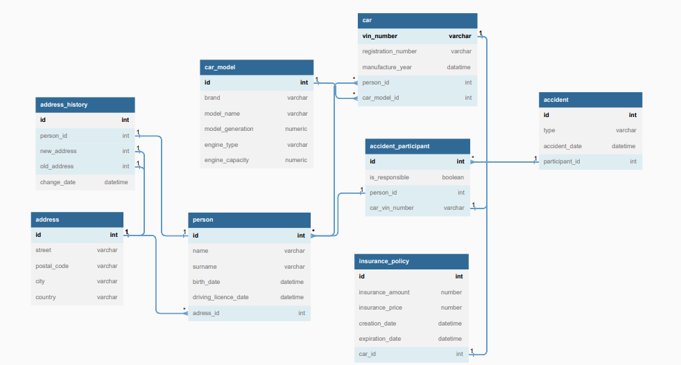

## 1. Opis projektu

Celem projektu jest stworzenie systemu, przypominającego ubezpieczalnię samochodów oraz za pomocą interfejsu API, który został zrealizowany przy użyciu języka *Java*, a dokładniej, frameworka *Spring Boot*.

W ramach projektu zostanie stworzona baza danych zawierająca informacje o samochodach, ich właścicielach oraz historii ubezpieczeń. Baza ta będzie dostępna dla agentów ubezpieczeniowych.

REST API będzie udostępniało metody CRUD na stworzonej przez nas bazy danych, takich jak:
- dodawanie
- wyświetlanie
- edytowanie
- usuwanie

Dodatkowe fukcjonalności są zrealizowane poprzez skrypty, fukcje, procedury i wyzwalacze opisane w dalszej części dokumentu.

 

## 2. Model ER
Struktura utworzonej bazy danych w głównej mierze opiera się na zamieszczonym modelu *ER*.

Skrypt umożliwiający założenie bazy danych nosi nazwę *create_tables.sql*, natomiast skrypt odpowiedzialny za ładowanie danych *insert_data.sql*.

 

## 3. Opis działania funkcji, wyzwalaczy i procedur. Skrypty testujące
Poniżej zamieszczone są opisy fukcjonalności zaimplementowanych przez nas funkcji, wyzwalaczy i procedur. Do każdej z wymienionych struktur stworzone zostały ich wywołania, które prezentują sposób działania. (*queries.sql*)

### Funkcje:
1. Obliczanie stosunku liczby samochodów z silnikiem benzynowym i silnikiem diesla do całkowitej liczby samochodów wyprodukowanych po ustalonym roku mających właścicieli w danym kraju. W przypadku braku takiego kraju w bazie danych wypisany zostaje stosowny komunikat. Funkcja zwraca większy ze stosunków.

2. Określ najpopularniejszy samochód z silnikiem danego typu w podanym kraju bez podziału na generacje i pojemność silnika.

### Procedury:
1. Procedura której celem jest zredukowanie liczby właścicieli do osoby najstarszej w przypadku gdy samochód ma co najmniej dwóch właścicieli.

2. Procedura której celem jest zmiana miejsca zameldowania osoby.

### Wyzwalacze:
1. Wyzwalacz, który po zmianie adresu zameldowania osoby dodaje nowy rekord do tabeli z historią adresów z informacją o czasie zmiany, Id osoby oraz nowym i starym adresie.

2. Wyzwalacz, który po dodaniu do samochodu nowego właściciela będzie wypisywać informacje o poprzednich właścicielach.

### Skrypty testujące:
Oprócz wspomnianych skryptów, napisane zostały dodatkowe skrypty, które wykorzystują różne rodzaje złączeń, filtrowanie oraz grupowanie danych.

1. Wyświetl średnią pojemność silnika samochodów z podziałem na marki, przy założeniu, że mają aktywne polisy,

2. Wyświetl liczbę sprawców wypadków drogowych z podziałem na marki.

3. Wyświetl średnią kwotę na którą zostały ubezpieczone samochody w poszczególnych krajach, przy założeniu, że właścicielami są osoby urodzone po 1985 roku.

4. Wyświetl liczbę samochodów zarejestrowanych na osoby mające prawo jazdy od przynajmnjej od 2010 roku względem miast w porzadku malejącym.

5. Wyświetl maksymalne roczne stawki ubezpieczenia w każdym mieście pod warunkiem, że liczba samochodów w mieście jest większa od 1.

